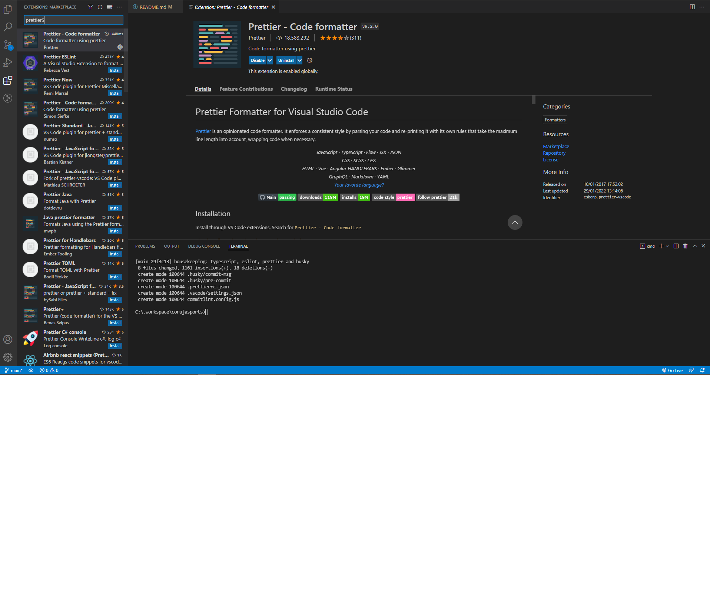

# Coruja Sports

Projeto de conclusão de curso Ecommerce baseado em camisetas e acessórios de esporte. 

## Instalando dependências

Caso você ja tenha o node instalado primeiramente rode o comando:

```bash
yarn install
```

## Começando

Para inicializar o servidor de desenvolvimento:

```bash
yarn dev
```

Abra o link [http://localhost:3000](http://localhost:3000) em seu navegador.

## Instalando extensões para desenvolvimento

É necessário instalar o prettier para manter o código identado.

<div align="center">

</div>
